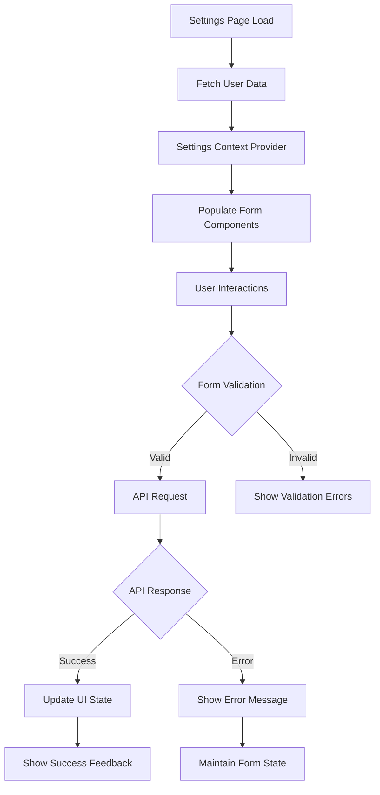

# Design Document

## Overview

This design transforms the static settings page into a fully functional user profile and preferences management system by integrating with existing backend APIs and creating new endpoints where needed. The solution maintains the existing UI structure while adding data fetching, form handling, validation, and persistence capabilities across all five settings categories.

The design leverages the existing user management infrastructure and extends it with comprehensive settings management, ensuring data consistency, security, and optimal user experience.

## Architecture

### Frontend Architecture

```
Settings Page (app/settings/page.tsx)
├── Settings Context Provider (NEW)
│   ├── User Data State Management
│   ├── Form State Management
│   ├── Loading State Management
│   └── Error State Management
├── Profile Settings Component
│   ├── Profile Form Handler (NEW)
│   ├── Avatar Upload Component (NEW)
│   └── Profile Data Validation (NEW)
├── Notification Settings Component
│   ├── Notification Preferences Handler (NEW)
│   └── Real-time Toggle Updates (NEW)
├── Privacy Settings Component
│   ├── Privacy Preferences Handler (NEW)
│   └── Data Deletion Confirmation (NEW)
├── Security Settings Component
│   ├── Password Change Handler (NEW)
│   ├── 2FA Management Component (NEW)
│   └── Session Management Component (NEW)
└── Preferences Settings Component
    ├── Theme Integration (EXISTING)
    ├── Language Preferences Handler (NEW)
    └── AI Assistant Settings Handler (NEW)
```

### Backend Architecture

```
FastAPI Backend
├── Existing APIs
│   ├── /api/users/profile (GET, PUT)
│   └── /api/auth/* (Authentication)
├── New Settings APIs (NEW)
│   ├── /api/settings/notifications (GET, PUT)
│   ├── /api/settings/privacy (GET, PUT)
│   ├── /api/settings/security (GET, PUT)
│   ├── /api/settings/preferences (GET, PUT)
│   └── /api/settings/sessions (GET, DELETE)
├── Enhanced User Model
│   ├── Notification Preferences (NEW)
│   ├── Privacy Settings (NEW)
│   ├── Security Configuration (NEW)
│   └── UI Preferences (NEW)
└── Security Services
    ├── Password Change Service (NEW)
    ├── 2FA Management Service (NEW)
    └── Session Management Service (NEW)
```

### Data Flow Architecture



## Components and Interfaces

### Settings Context Provider

**Location:** `contexts/settings-context.tsx` (NEW)

**Purpose:** Centralized state management for all settings data and operations

**State Management:**
```typescript
interface SettingsContextState {
  user: User | null;
  loading: {
    profile: boolean;
    notifications: boolean;
    privacy: boolean;
    security: boolean;
    preferences: boolean;
  };
  errors: {
    profile?: string;
    notifications?: string;
    privacy?: string;
    security?: string;
    preferences?: string;
  };
  unsavedChanges: boolean;
}
```

**Key Methods:**
- `fetchUserData()`: Load complete user profile and settings
- `updateProfile(data)`: Update profile information
- `updateNotifications(data)`: Update notification preferences
- `updatePrivacy(data)`: Update privacy settings
- `updateSecurity(data)`: Update security settings
- `updatePreferences(data)`: Update UI preferences
- `resetChanges()`: Revert unsaved changes

### Enhanced Settings Components

**Profile Settings Component Updates:**
```typescript
interface ProfileFormData {
  firstName: string;
  lastName: string;
  email: string;
  phoneNumber?: string;
  dateOfBirth?: Date;
  role: UserRole;
  avatar?: string;
  bio?: string;
}

// Form validation schema
const profileSchema = z.object({
  firstName: z.string().min(1).max(50),
  lastName: z.string().min(1).max(50),
  email: z.string().email(),
  phoneNumber: z.string().optional(),
  dateOfBirth: z.date().optional(),
  role: z.enum(['student', 'workplace_newcomer', 'entrepreneur', 'other']),
  bio: z.string().max(500).optional()
});
```

**Notification Settings Component Updates:**
```typescript
interface NotificationPreferences {
  aiSolutionComplete: boolean;
  emailReminders: boolean;
  pushNotifications: boolean;
  weeklyDigest: boolean;
  featureUpdates: boolean;
  morningTime: string;
  eveningTime: string;
}
```

**Privacy Settings Component Updates:**
```typescript
interface PrivacySettings {
  dataSharing: boolean;
  personalizedRecommendations: boolean;
  marketingCommunications: boolean;
  thirdPartyIntegrations: boolean;
  dataRetentionPeriod: 'never' | '1year' | '2years' | '5years';
}
```

**Security Settings Component Updates:**
```typescript
interface SecuritySettings {
  twoFactorEnabled: boolean;
  activeSessions: Session[];
  lastPasswordChange: Date;
}

interface Session {
  id: string;
  device: string;
  location: string;
  lastActive: Date;
  current: boolean;
}
```

### API Integration Layer

**Settings API Client:**
```typescript
class SettingsAPI {
  static async getProfile(): Promise<User> {
    return fetch('/api/users/profile').then(res => res.json());
  }

  static async updateProfile(data: ProfileFormData): Promise<void> {
    return fetch('/api/users/profile', {
      method: 'PUT',
      headers: { 'Content-Type': 'application/json' },
      body: JSON.stringify(data)
    });
  }

  static async getNotificationSettings(): Promise<NotificationPreferences> {
    return fetch('/api/settings/notifications').then(res => res.json());
  }

  static async updateNotificationSettings(data: NotificationPreferences): Promise<void> {
    return fetch('/api/settings/notifications', {
      method: 'PUT',
      headers: { 'Content-Type': 'application/json' },
      body: JSON.stringify(data)
    });
  }

  // Similar methods for privacy, security, and preferences
}
```

## Data Models

### Enhanced User Model (Backend)

**MongoDB Schema Extensions:**
```python
class UserSettings(BaseModel):
    notifications: NotificationPreferences = Field(default_factory=NotificationPreferences)
    privacy: PrivacySettings = Field(default_factory=PrivacySettings)
    security: SecuritySettings = Field(default_factory=SecuritySettings)
    preferences: UIPreferences = Field(default_factory=UIPreferences)

class NotificationPreferences(BaseModel):
    ai_solution_complete: bool = True
    email_reminders: bool = True
    push_notifications: bool = False
    weekly_digest: bool = True
    feature_updates: bool = False
    morning_time: str = "09:00"
    evening_time: str = "20:00"

class PrivacySettings(BaseModel):
    data_sharing: bool = False
    personalized_recommendations: bool = True
    marketing_communications: bool = False
    third_party_integrations: bool = False
    data_retention_period: str = "never"

class SecuritySettings(BaseModel):
    two_factor_enabled: bool = False
    password_change_required: bool = False
    session_timeout: int = 3600  # seconds

class UIPreferences(BaseModel):
    theme: str = "light"
    language: str = "zh-CN"
    date_format: str = "YYYY-MM-DD"
    timezone: str = "Asia/Shanghai"
    ai_assistant_style: str = "balanced"
    detailed_analysis: bool = True
    quick_response: bool = False
```

### Frontend Type Definitions

**TypeScript Interfaces:**
```typescript
interface User {
  id: string;
  email: string;
  profile: UserProfile;
  settings: UserSettings;
  createdAt: Date;
  updatedAt: Date;
}

interface UserProfile {
  firstName: string;
  lastName: string;
  role: UserRole;
  avatar?: string;
  phoneNumber?: string;
  dateOfBirth?: Date;
  bio?: string;
}

interface UserSettings {
  notifications: NotificationPreferences;
  privacy: PrivacySettings;
  security: SecuritySettings;
  preferences: UIPreferences;
}
```

## Error Handling

### Frontend Error Management

**Error Boundary Implementation:**
```typescript
class SettingsErrorBoundary extends React.Component {
  // Handle React component errors
  // Provide fallback UI for critical failures
  // Log errors for debugging
}
```

**API Error Handling:**
```typescript
class APIError extends Error {
  constructor(
    public status: number,
    public message: string,
    public field?: string
  ) {
    super(message);
  }
}

const handleAPIError = (error: APIError) => {
  switch (error.status) {
    case 400: return "Invalid input data";
    case 401: return "Authentication required";
    case 403: return "Permission denied";
    case 422: return `Validation error: ${error.message}`;
    case 500: return "Server error, please try again";
    default: return "An unexpected error occurred";
  }
};
```

### Backend Error Handling

**Validation Error Responses:**
```python
@router.put("/settings/notifications")
async def update_notification_settings(
    settings: NotificationPreferences,
    current_user: dict = Depends(get_current_user)
):
    try:
        # Validate and update settings
        pass
    except ValidationError as e:
        raise HTTPException(
            status_code=422,
            detail={"field": e.field, "message": e.message}
        )
    except Exception as e:
        logger.error(f"Settings update failed: {e}")
        raise HTTPException(
            status_code=500,
            detail="Failed to update settings"
        )
```

## Security Considerations

### Data Protection

**Sensitive Data Handling:**
- Phone numbers encrypted using AES-256
- Password changes require current password verification
- 2FA secrets stored with additional encryption layer
- Session tokens use secure HTTP-only cookies

**Input Validation:**
- All form inputs validated on both client and server
- SQL injection prevention through parameterized queries
- XSS prevention through input sanitization
- CSRF protection via token validation

### Authentication & Authorization

**Access Control:**
- All settings endpoints require valid JWT authentication
- Users can only access/modify their own settings
- Admin endpoints separated with role-based access
- Session management with automatic timeout

## Testing Strategy

### Frontend Testing

**Component Testing:**
```typescript
describe('ProfileSettings', () => {
  test('loads user data on mount', async () => {
    // Mock API response
    // Render component
    // Verify data loading and display
  });

  test('validates form input', async () => {
    // Test validation rules
    // Test error message display
    // Test form submission prevention
  });

  test('handles API errors gracefully', async () => {
    // Mock API error
    // Verify error handling
    // Test user feedback
  });
});
```

**Integration Testing:**
```typescript
describe('Settings Integration', () => {
  test('complete settings update flow', async () => {
    // Test full user journey
    // Verify data persistence
    // Test cross-component updates
  });
});
```

### Backend Testing

**API Endpoint Testing:**
```python
def test_update_profile_success():
    # Test successful profile update
    # Verify data encryption
    # Check response format

def test_update_profile_validation_error():
    # Test invalid input handling
    # Verify error response format
    # Check data integrity

def test_settings_authentication():
    # Test authentication requirements
    # Verify unauthorized access prevention
    # Test token validation
```

### End-to-End Testing

**User Journey Testing:**
- Complete settings management workflow
- Cross-browser compatibility testing
- Mobile responsiveness verification
- Performance testing under load
