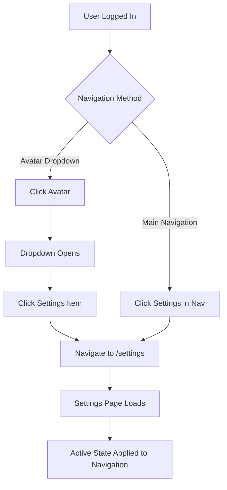

# Design Document

## Overview

This design implements navigation entry points for the existing settings page by adding settings access through both the user avatar dropdown menu and the main navigation bar. The solution follows established UX patterns and maintains consistency with the existing navigation system while ensuring the settings page becomes discoverable and accessible to users.

The design leverages the existing header component structure and extends the current navigation patterns without disrupting the established user interface flow.

## Architecture

### Component Structure

```
Header Component (components/header.tsx)
├── UserMenu Component
│   ├── Avatar Dropdown
│   │   ├── User Info Display
│   │   ├── Settings Menu Item (NEW)
│   │   └── Sign Out Action
│   └── Authentication Buttons (for non-logged users)
└── NavigationMenu Component
    ├── Existing Navigation Items
    │   ├── 经历收集 (/experience)
    │   ├── AI方案 (/ai-solutions)
    │   ├── 数据分析 (/analytics)
    │   ├── 评价系统 (/rating-demo)
    │   ├── 经历总结 (/experience-summary)
    │   ├── 安全中心 (/security)
    │   └── 隐私中心 (/privacy)
    └── Settings Navigation Item (NEW)
        └── 设置 (/settings)
```

### Navigation Flow



## Components and Interfaces

### UserMenu Component Updates

**Location:** `components/header.tsx` - UserMenu function

**Changes Required:**
- Add Settings menu item to the dropdown content
- Include Settings icon from Lucide React
- Add proper accessibility attributes
- Maintain existing styling patterns

**New Menu Item Structure:**
```tsx
<DropdownMenuItem asChild>
  <Link href="/settings" className="flex items-center">
    <Settings className="mr-2 h-4 w-4" />
    <span>账户设置</span>
  </Link>
</DropdownMenuItem>
```

### NavigationMenu Component Updates

**Location:** `components/header.tsx` - NavigationMenu function

**Changes Required:**
- Add Settings navigation link to the main navigation
- Include Settings icon for visual consistency
- Apply active state styling when on settings page
- Maintain responsive behavior

**New Navigation Item Structure:**
```tsx
<Link
  href="/settings"
  className="flex items-center space-x-2 text-sm font-medium text-foreground/80 hover:text-foreground transition-colors"
>
  <Settings className="h-4 w-4" />
  <span>设置</span>
</Link>
```

### Active State Management

**Implementation Approach:**
- Use Next.js `usePathname` hook to detect current route
- Apply conditional styling based on pathname matching
- Ensure consistent active state across both navigation methods

**Active State Logic:**
```tsx
const pathname = usePathname();
const isSettingsActive = pathname === '/settings';

// Apply conditional className
className={`flex items-center space-x-2 text-sm font-medium transition-colors ${
  isSettingsActive
    ? 'text-foreground font-semibold'
    : 'text-foreground/80 hover:text-foreground'
}`}
```

## Data Models

### Navigation State Interface

```typescript
interface NavigationState {
  currentPath: string;
  isAuthenticated: boolean;
  user: User | null;
}

interface NavigationItem {
  href: string;
  label: string;
  icon: LucideIcon;
  isActive: boolean;
  requiresAuth: boolean;
}
```

### User Context Requirements

The navigation updates require access to:
- User authentication state (existing via SWR)
- Current pathname (via Next.js usePathname)
- Navigation permissions (based on authentication)

## Error Handling

### Authentication State Handling

**Scenario:** User becomes unauthenticated while on settings page
**Solution:** Redirect to sign-in page via middleware (existing behavior)

**Scenario:** Navigation renders before user data loads
**Solution:** Use Suspense boundary and loading states (existing pattern)

### Route Protection

**Scenario:** Direct navigation to /settings without authentication
**Solution:** Leverage existing middleware protection for authenticated routes

**Scenario:** Settings page not found or errors
**Solution:** Use existing error boundaries and not-found page handling

### Accessibility Error Prevention

**Implementation:**
- Proper ARIA labels for all navigation items
- Keyboard navigation support
- Screen reader compatibility
- Focus management for dropdown interactions

## Testing Strategy

### Unit Testing

**UserMenu Component Tests:**
- Verify settings menu item appears for authenticated users
- Verify settings menu item hidden for unauthenticated users
- Test dropdown interaction and navigation
- Validate accessibility attributes

**NavigationMenu Component Tests:**
- Verify settings navigation item appears for authenticated users
- Test active state application on settings page
- Validate responsive behavior
- Test keyboard navigation

### Integration Testing

**Navigation Flow Tests:**
- Test complete user journey from login to settings access
- Verify both navigation methods lead to same destination
- Test navigation state persistence across page reloads
- Validate proper authentication checks

**Cross-Component Testing:**
- Test interaction between UserMenu and NavigationMenu
- Verify consistent styling and behavior
- Test responsive breakpoint behavior
- Validate theme compatibility

### Accessibility Testing

**Screen Reader Testing:**
- Verify proper announcement of navigation items
- Test dropdown menu accessibility
- Validate focus management
- Check ARIA label accuracy

**Keyboard Navigation Testing:**
- Test tab order through navigation elements
- Verify Enter/Space key activation
- Test escape key dropdown closing
- Validate focus indicators

### Visual Regression Testing

**Styling Consistency:**
- Compare navigation styling with existing items
- Test hover and active states
- Verify responsive layout integrity
- Check theme compatibility (light/dark modes)

**Cross-Browser Testing:**
- Test navigation rendering across browsers
- Verify dropdown positioning
- Test responsive behavior on different devices
- Validate icon rendering consistency
